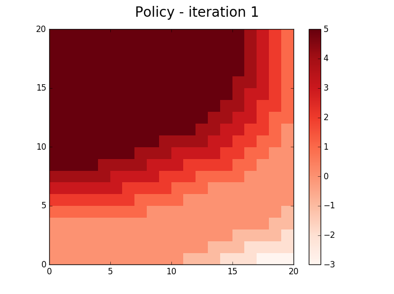

##Jack's car rental - policy iteration
The implementation of Jack's car rental example covered in chapter 4.3 of the book (second edition).

The policy does not converge as in the book, after the initial iteration the policy result switches between two policies.
Possibly a bug, or it requires additional checking to prevent switching between policies.
 