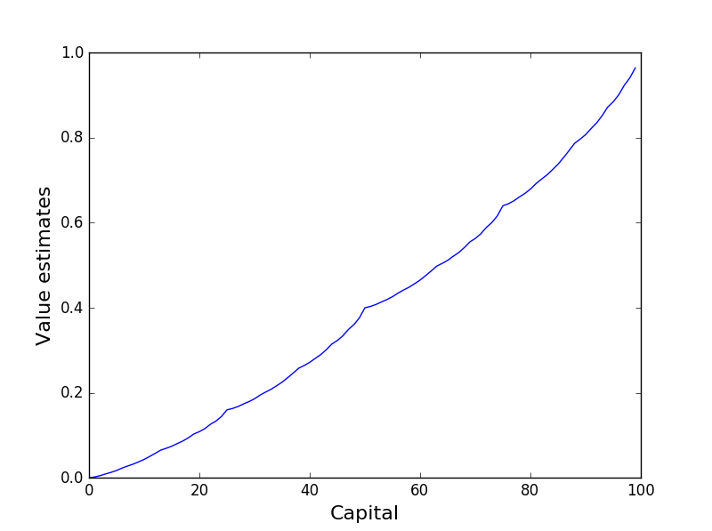
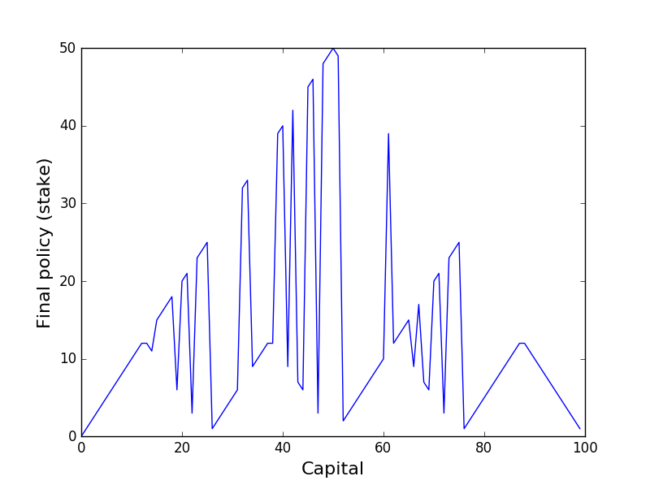

The implementation of Gambler's problem example covered in chapter 4.4 of the book (second edition).

The value estimates are

The policy

Note that the policy is optimal, but not unique. There is a whole family of optimal policies.
 