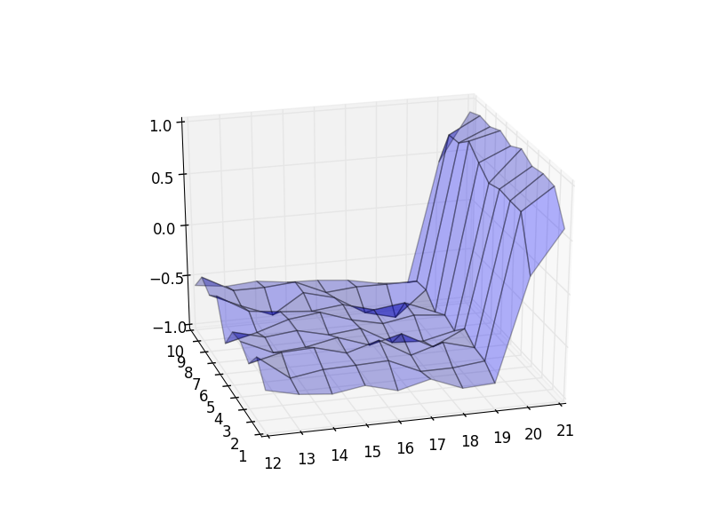
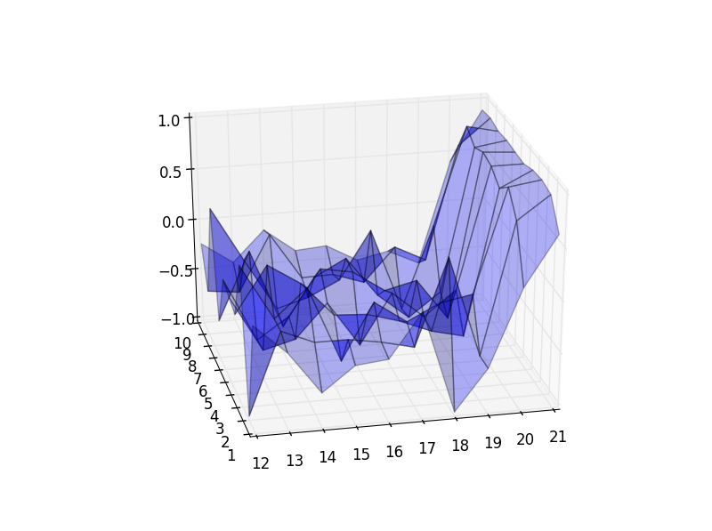
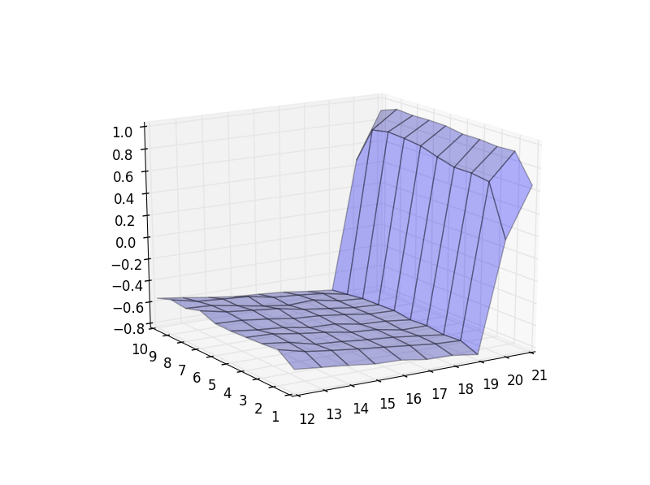
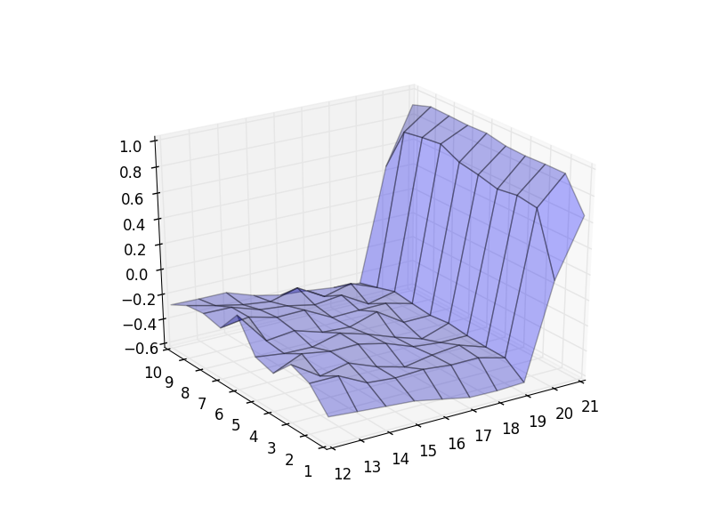

The implementation of Blackjack example covered in chapter 5.1 of the book (second edition).

Results:

Approximate state-value function for scenarios without usable ace after 10,000 episodes

Approximate state-value function for scenarios with usable ace after 10,000 episodes

Approximate state-value function for scenarios without usable ace after 500,000 episodes

Approximate state-value function for scenarios with usable ace after 500,000 episodes

