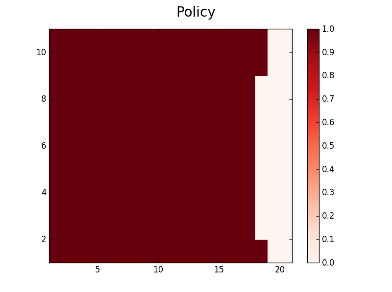
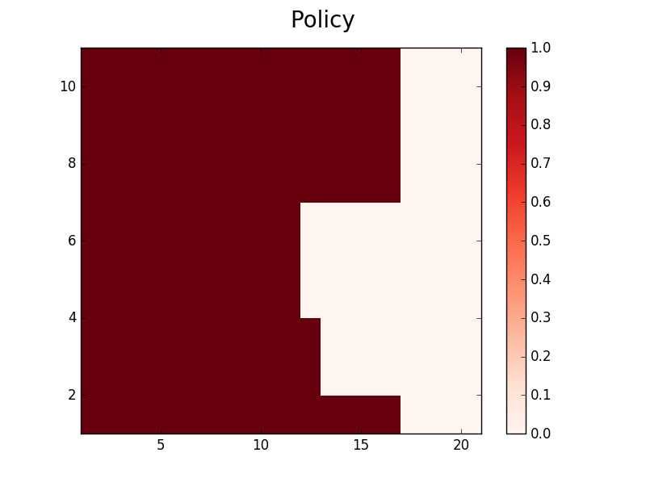
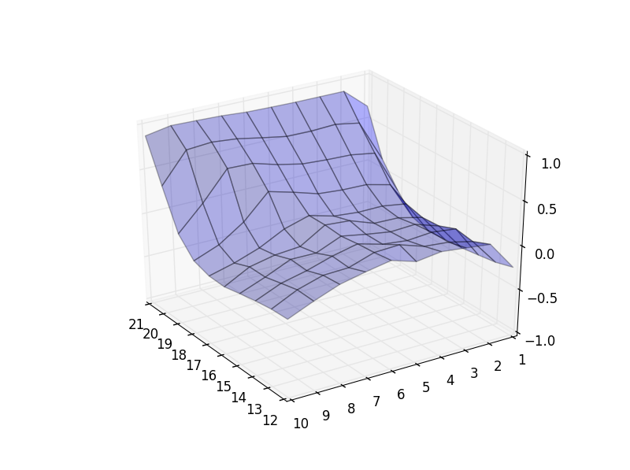
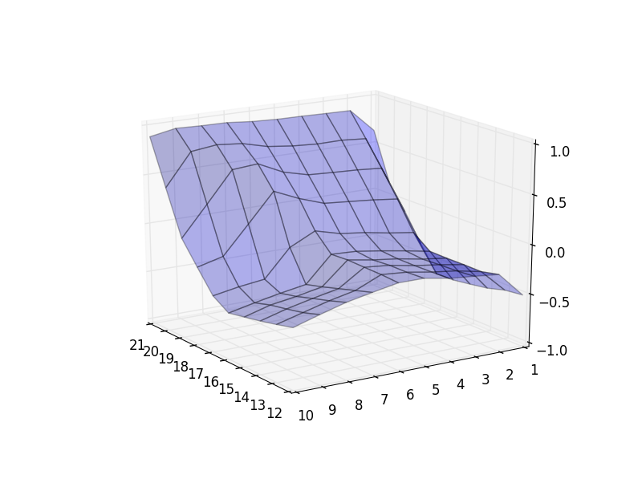
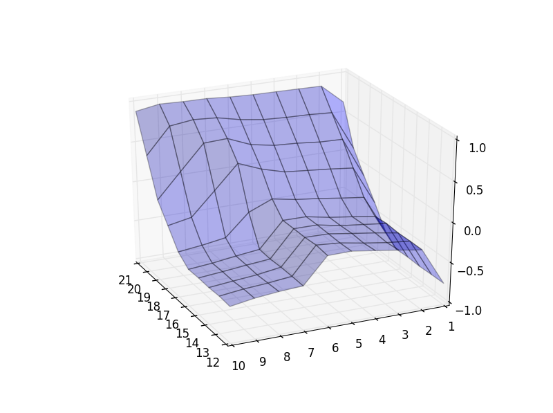
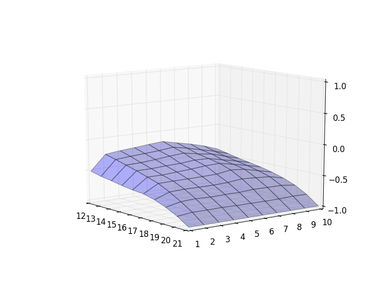

Monte Carlo control with exploring starts - Python implementation of Blackjack example covered in section 5.3 of the book (second edition).

Results after 5,000,000 episodes:

Policy (with usable ace)

Policy (without usable ace)

State-value function computed from action-value function (with usable ace)

State-value function computed from action-value function (without usable ace)

Action-value function for all states for action stick

Action-value function for all states for action hit

