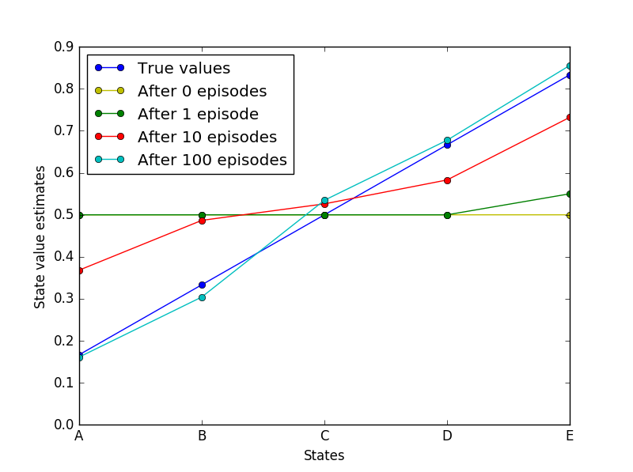
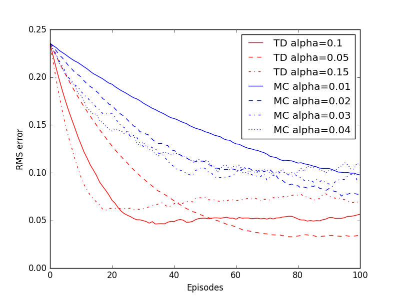

##Temporal difference learning 
Python implementation of Random Walk example covered in section 6.2 of the book (second edition).

Results from a single run plotting state values after various number of episodes: 

*Note: results may vary after every run due to randomness of the walk*

Empirical RMS error averaged over states.
Data are averages over 100 sequences of 100 episodes

