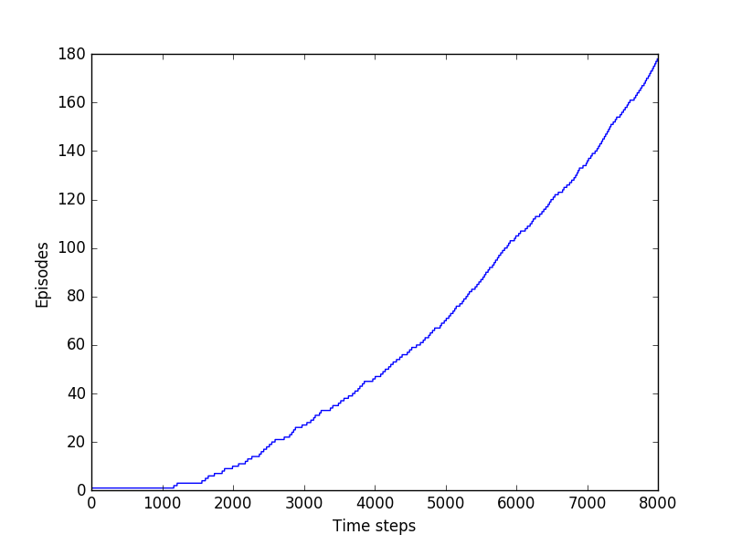

##SARSA: On-Policy TD Control
Python implementation of Windy Gridworld example covered in section 6.4 of the book (second edition).

The results:
Action map for every state (the final policy). In this case the path from start to goal is optimal.
*Note: results may vary after every run due stochasticity introduced by ε-greedy*
```
←↑↓→→→→→→↓
←↓→→→→→→↓↓
←↑↓→→→→↓→↓
→→→→→→→↓→↓
→↓→→→→↓↓←←
→↓→→→↓↓↓←↓
→→→→↓↓↓↓↑←
```



