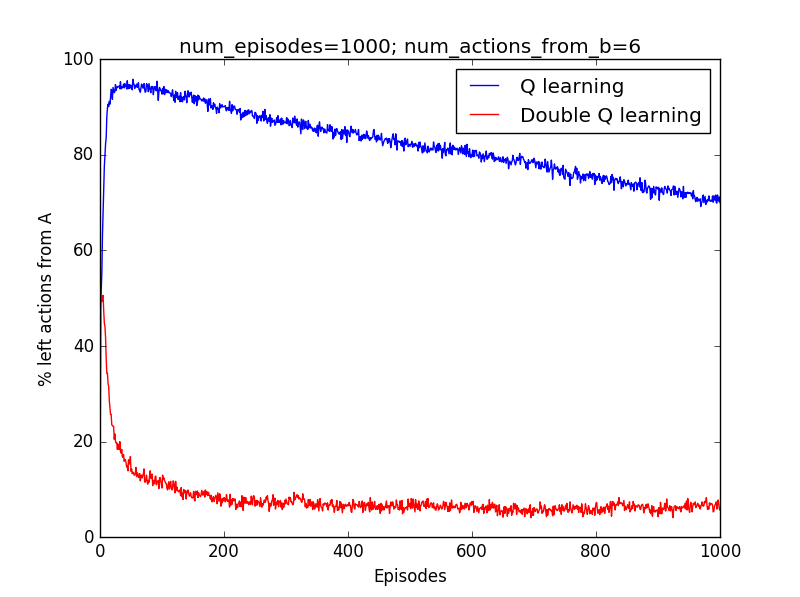

##Maximization bias and double learning
Python implementation of Maximization bias example covered in section 6.7 of the book (second edition).

The results:
Comparison of Q-learning and Double learning based on 1000 episodes averaged over 1000 runs. There are 6 possible acions from state B and all cause immediate termination.

