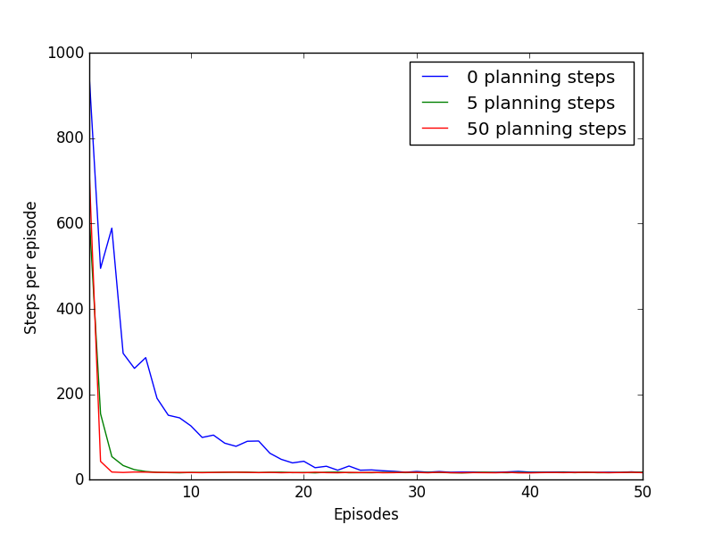

##Dyna: Integrating planning, acting and learning
Python implementation of Dyna maze example covered in section 8.2 of the book (second edition).

The results showing the learning curves for Dyna-Q agents with 0, 5 and 50 planning steps per real step:

The curves show the number of steps taken in each episode averaged over 30 repetitions of the experiment.

